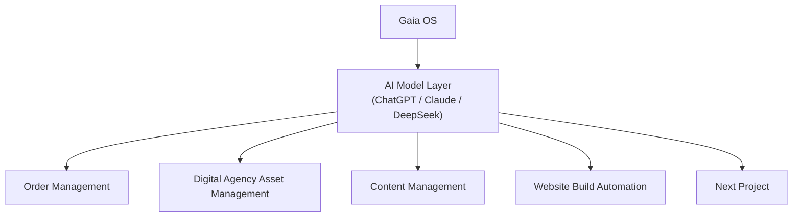

# Gaia OS — 180-Day Accumulation Plan

**Prepared for:** Gaia Digital Agency  
**Date:** 2026-04-24  
**Purpose:** Concise 180-day plan for building Gaia OS through 12 execution projects aligned to Gaia’s real agency services and client needs.

## Table of Contents

1. Executive Intent
2. Foundation Hierarchy
3. Plan Logic
4. Core Rules
5. Project Selection Principle
6. 180-Day Structure
7. 12 Projects Across 180 Days
8. Shared Operating Model
9. Multi-Organization AI Stack
10. Shared Technical Stack
11. Agent-System Architecture
12. Critical Success Factors
13. Day-180 End State

## 1. Executive Intent

Gaia should use the next 180 days to build one operating system for agency delivery: controlled, reusable, measurable, and scalable without linear headcount growth.

Each project must do two things:

- solve a real agency or client need,
- leave behind a reusable Gaia OS capability.

## 2. Foundation Hierarchy

This hierarchy is the foundation of the plan. The first four projects are the initial build path into it.

Interpretation:

- `Gaia OS` is the umbrella operating layer.
- `AI Model Layer` is the execution and orchestration layer.
- The first four projects build the base operating modules.
- The next eight projects use that base to solve agency service needs and expand Gaia OS.

## 3. Plan Logic

- `12 projects`
- `14 days target per project`
- `Project 1 starts Day 1`
- `Days 1-168` used for execution
- `Days 169-180` reserved for stabilization, gap closure, and go-live hardening

This is not a phase narrative. It is a project accumulation plan.

## 4. Core Rules

- AI is the execution and orchestration layer; humans remain accountable.
- No public output, client commitment, budget change, pricing change, or production deployment without human approval.
- All work enters through controlled intake and workflow states.
- Memory is scoped by organization, module, client, and task.
- Every project must create reusable capability, not one-off delivery.
- Governance, routing, audit, and observability are mandatory from the start.

## 5. Project Selection Principle

The 12 projects are based on two filters:

- Gaia’s existing or visible service demand: website, branding, digital marketing, ads, SEO, social media, content, PR, account support.
- Gaia OS build value: each project must strengthen the operating system, not just produce isolated output.

## 6. 180-Day Structure

The 180 days should be organized as four project waves plus a final stabilization block. These are dependency waves, not abstract transformation phases.

### Wave 1 — Base Control and Production Core
**Days 1-56 | Projects 1-4**

Build the four identified starting projects first because every later service depends on them:

- Order Management
- Digital Agency Asset Management
- Content Management
- Website Build Automation

Output of Wave 1:

- Gaia can intake, route, store, review, and deliver work through a controlled base layer.

### Wave 2 — Brand and Creative Service Expansion
**Days 57-84 | Projects 5-6**

Use the base layer to extend into client-facing brand and design work:

- Branding Strategy and Identity Delivery
- Design Production Workflow

Output of Wave 2:

- Gaia can run strategic and creative production through structured workflows instead of ad hoc coordination.

### Wave 3 — Marketing Execution Expansion
**Days 85-140 | Projects 7-10**

Extend Gaia OS into recurring digital marketing execution:

- Social Media Managed Service
- Ads Campaign Planning and Optimization
- SEO Research and Optimization
- Digital Marketing Strategy and Calendar

Output of Wave 3:

- Gaia can run recurring content and marketing execution through one shared operating system.

### Wave 4 — Communications and Client Visibility
**Days 141-168 | Projects 11-12**

Close the loop with high-sensitivity communication and retained-service visibility:

- Public Relations and Communications Workflow
- Client Reporting and Performance Insight

Output of Wave 4:

- Gaia can manage both outward communication and inward reporting through controlled operating logic.

### Stabilization Block
**Days 169-180**

Use the final 12 days to:

- close integration gaps,
- harden approvals,
- clean workflow exceptions,
- finalize documentation,
- confirm Day-180 readiness.

## 7. 12 Projects Across 180 Days

### Project 1 — Order Management
**Window:** Days 1-14  
**Reason:** foundational project already identified  
**Client / agency need:** controlled intake, routing, approval, and close-out of requests  
**Gaia OS contribution:** operating control layer

### Project 2 — Digital Agency Asset Management
**Window:** Days 15-28  
**Reason:** foundational project already identified  
**Client / agency need:** source-of-truth asset, metadata, tagging, approval, and retrieval  
**Gaia OS contribution:** reusable asset and brand memory layer

### Project 3 — Content Management
**Window:** Days 29-42  
**Reason:** foundational project already identified  
**Client / agency need:** brief, draft, review, publish handoff, refresh, and editorial control  
**Gaia OS contribution:** structured content operations layer

### Project 4 — Website Build Automation
**Window:** Days 43-56  
**Reason:** foundational project already identified  
**Client / agency need:** faster website build, QA, staging, deployment, and handoff  
**Gaia OS contribution:** web delivery automation layer

### Project 5 — Branding Strategy and Identity Delivery
**Window:** Days 57-70  
**Reason:** added from Gaia service demand  
**Client / agency need:** positioning, brand direction, messaging system, and identity consistency  
**Gaia OS contribution:** brand rules, identity memory, and approval logic

### Project 6 — Design Production Workflow
**Window:** Days 71-84  
**Reason:** added from Gaia service demand  
**Client / agency need:** creative brief intake, design queue, revision control, and approval flow  
**Gaia OS contribution:** structured creative production workflow

### Project 7 — Social Media Managed Service
**Window:** Days 85-98  
**Reason:** added from Gaia service demand  
**Client / agency need:** calendar planning, draft creation, review, scheduling handoff, and community support  
**Gaia OS contribution:** recurring social operations module

### Project 8 — Ads Campaign Planning and Optimization
**Window:** Days 99-112  
**Reason:** added from Gaia service demand  
**Client / agency need:** campaign planning, creative-angle testing, optimization memos, and approval gates  
**Gaia OS contribution:** performance marketing workflow logic

### Project 9 — SEO Research and Optimization
**Window:** Days 113-126  
**Reason:** added from Gaia service demand  
**Client / agency need:** keyword research, page mapping, content briefs, on-page fixes, and reporting support  
**Gaia OS contribution:** search workflow and SEO memory layer

### Project 10 — Digital Marketing Strategy and Calendar
**Window:** Days 127-140  
**Reason:** added from Gaia service demand  
**Client / agency need:** goals, audience logic, channel mix, budget framing, tactic plan, and marketing calendar  
**Gaia OS contribution:** strategic planning and cross-channel coordination layer

### Project 11 — Public Relations and Communications Workflow
**Window:** Days 141-154  
**Reason:** added from Gaia service demand  
**Client / agency need:** PR brief intake, message control, approval, escalation, and distribution support  
**Gaia OS contribution:** reputational-risk workflow and high-sensitivity approval logic

### Project 12 — Client Reporting and Performance Insight
**Window:** Days 155-168  
**Reason:** added from client retention need  
**Client / agency need:** weekly and monthly insight summaries, anomaly flags, next actions, and account visibility  
**Gaia OS contribution:** management visibility and optimization layer

## 8. Shared Operating Model

All projects should use one common flow:

1. intake  
2. context loading  
3. planning  
4. execution / drafting  
5. QA / compliance  
6. human review  
7. release / publish / deploy  
8. monitoring  
9. learning / refinement

This keeps the service lanes different in output but consistent in control.

## 9. Multi-Organization AI Stack

Gaia should run one stack on one server with separated domains:

- `Commercial Operations`
  - sales
  - support
  - booking / order handling
- `Digital Agency Operations`
  - branding
  - design
  - content
  - social media
  - ads
  - SEO
  - website
- `Shared Gaia OS Services`
  - memory
  - workflow state
  - routing
  - approval
  - audit
  - operator UI
  - API gateway

## 10. Shared Technical Stack

- `GCP` for environments, storage, networking, logging, and secrets
- `PostgreSQL` for workflow state, memory index, approvals, and audit records
- `Object storage` for assets, site artifacts, briefs, exports, and logs
- `Operator UI` for queue control, approvals, memory references, and execution visibility
- `API / endpoints` for internal tools, external platforms, webhooks, and deployment flows
- `ChatGPT` for orchestration, structure, drafting, and general reasoning
- `Claude` for long-context planning, review, content, and code workflows
- `DeepSeek` for bounded lower-cost technical support tasks
- `PRTVN stack` for Gaia application and web delivery implementation
- integrations to social platforms, ad platforms, SEO tooling, CMS, analytics, and client systems

## 11. Agent-System Architecture

Default structure:

- `Orchestrator`: intake, triage, routing, escalation, coordination
- `Agent`: service-lane or module owner
- `Subagent`: narrow specialist executor

Initial operating layout:

- `Commercial orchestrator`
  - order agent
  - sales / proposal agent
  - support / booking agent
- `Digital agency orchestrator`
  - branding agent
  - design agent
  - content agent
  - social media agent
  - ads / SEO agent
  - web delivery agent

Memory boundaries:

- organization memory
- module memory
- client memory
- task memory

Minimum workflow states:

- `new`
- `triaged`
- `in progress`
- `qa`
- `awaiting approval`
- `approved`
- `released`
- `closed`
- `exception`

YAML patterns should define:

- role
- mission
- memory scope
- input contract
- output contract
- escalation triggers
- approval rules
- model preference
- tool access

## 12. Critical Success Factors

- strong ownership and decision rights from Day 1,
- controlled intake and workflow state across all active projects,
- structured memory that improves with every client engagement,
- human approval at all commercial, reputational, and deployment edges,
- operator UI that gives real visibility into queue, approval, and exceptions,
- reliable routing, escalation, and auditability across organizations,
- reusable templates, prompts, playbooks, and logic captured as Gaia OS assets,
- measurable improvement in speed, consistency, and coordination load,
- stable technical stack across GCP, models, storage, APIs, and delivery tooling,
- disciplined expansion: no new project enters Gaia OS without ownership, use case clarity, and integration readiness.

## 13. Day-180 End State

By Day 180, Gaia should have:

- 12 executed projects completed or operationally landed,
- a working Gaia OS control layer covering intake, workflow state, approval, routing, and audit,
- active operating workflows for order handling, assets, content, website delivery, branding, design, social, ads, SEO, marketing planning, PR, and reporting,
- one shared multi-organization stack on one server supporting both commercial and digital agency operations,
- structured memory accumulating across clients, modules, and tasks,
- practical model use across ChatGPT, Claude, and DeepSeek by task type,
- a clearer service-delivery system that is more repeatable, more visible, and less dependent on manual coordination.
