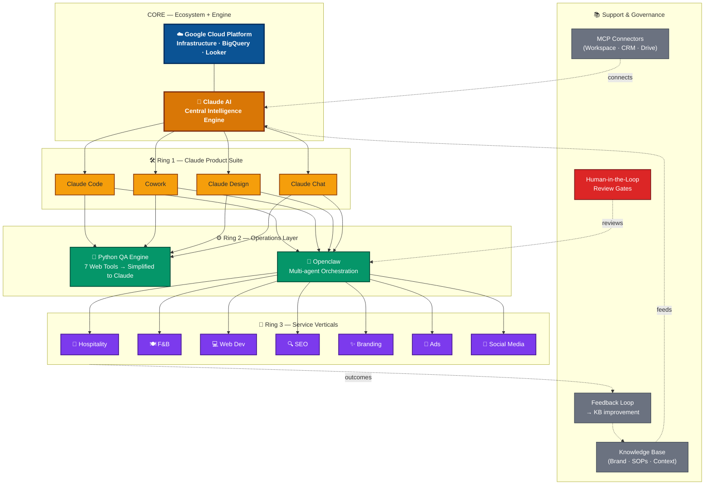
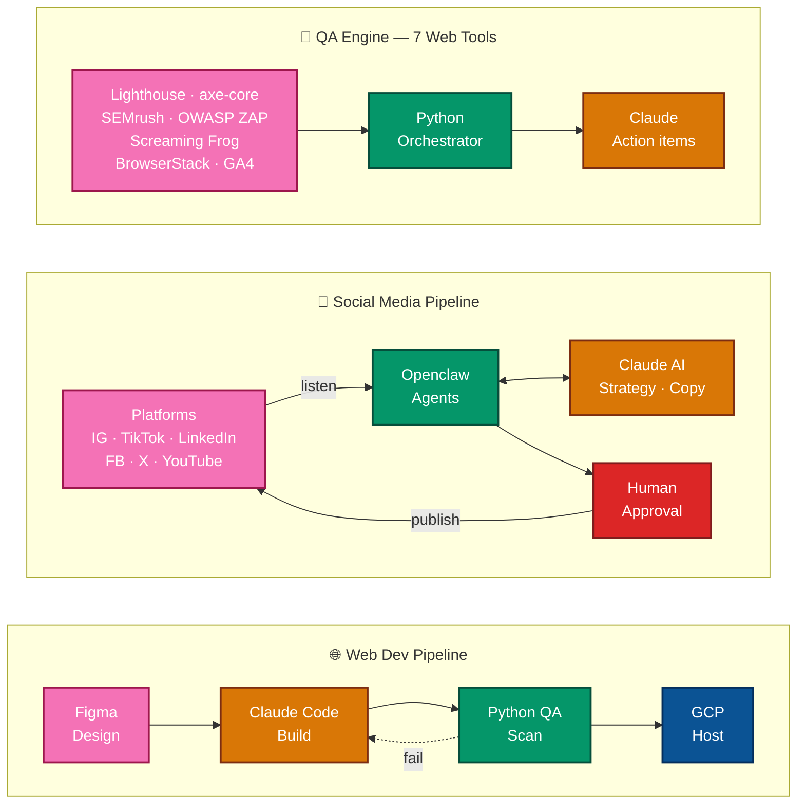
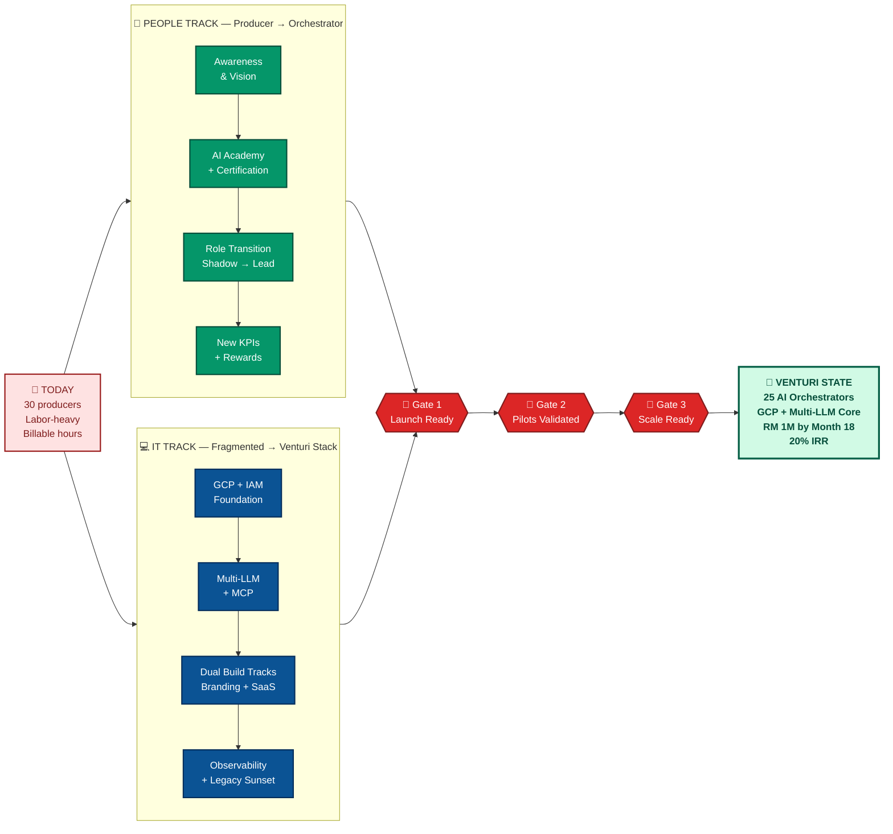

# Gaia AI — Operating Model & Change Reference

**Organization:** Gaia Digital Agency (www.gaiada.com)
**Model:** Venturi-based, Claude-centric AI Operating Architecture
**Companion to:** Gaia AI Business Plan

## 1. Core Operating Model — The Concentric Architecture

Reads inside-out: **GCP ecosystem + Claude AI core → Claude tools → Operations layer (QA + Openclaw) → 7 client service verticals**, with Knowledge Base, MCP, Governance, and Feedback as supporting layers.

## 2. Delivery Pipelines — Three Signature Flows

Three service pipelines share one orchestration core: **Web Dev** (Figma→Code→GCP), **Social Media** (platforms ↔ Openclaw ↔ Claude), and the **QA engine** (7 tools → Python → Claude actions).

## 3. Change Management — Dual-Track Transformation

Two parallel tracks (**People + IT**) running from Today's labor-heavy state to the Venturi target state, gated by the 90-day build-to-operate checkpoints.

### Role Evolution at a Glance

| From (Producer) | To (Orchestrator) |
|---|---|
| Content Writer | Content Orchestrator + Brand Guardian |
| Web Developer | AI-Assisted Engineer + Solution Architect |
| SEO Specialist | SEO Strategist + QA Reviewer |
| Designer | Creative Director + Prompt Curator |
| Account Manager | Client Success + Managed-Service Lead |
| Social Media Exec | Community Strategist + Agent Supervisor |

### Current → Target IT State

| Layer | Today | Venturi Target |
|---|---|---|
| **AI** | Ad-hoc ChatGPT + Gemini | Claude (primary) + OpenAI + Gemini + DeepSeek |
| **Infra** | Mixed hosting | GCP-led hybrid |
| **Build** | Per-project tooling | Branding track (React/Vite) + SaaS track (Next/Nest) |
| **QA** | Manual spreadsheets | Python engine + 7 web tools |
| **Knowledge** | Scattered | Central KB + Vector DB + MCP |
| **Analytics** | Reports on request | BigQuery + Looker dashboards |

## 4. Integrated Timeline — People + IT + Gates (Phased)

```mermaid
%%{init: {"flowchart": {"subGraphTitleMargin": {"top": 20, "bottom": 10}}}}%%
flowchart LR
    classDef phase fill:#FEF3C7,stroke:#92400E,color:#78350F,stroke-width:2px,font-weight:bold
    classDef people fill:#059669,stroke:#064E3B,color:#fff,stroke-width:2px
    classDef tech fill:#0B5394,stroke:#052E5C,color:#fff,stroke-width:2px
    classDef commercial fill:#7C3AED,stroke:#4C1D95,color:#fff,stroke-width:2px
    classDef gate fill:#DC2626,stroke:#7F1D1D,color:#fff,stroke-width:2px,font-weight:bold
    classDef outcome fill:#D1FAE5,stroke:#065F46,color:#064E3B,stroke-width:3px,font-weight:bold

    subgraph PH1["PHASE 1 · Foundation"]
        direction TB
        F1["👥 Change Lead appointed<br/>Awareness campaign"]:::people
        F2["💻 GCP + IAM setup<br/>Multi-LLM + MCP rollout"]:::tech
    end

    subgraph PH2["PHASE 2 · Service Build"]
        direction TB
        S1["👥 AI Academy<br/>Role mapping & redeployment"]:::people
        S2["💻 Dual build tracks<br/>Knowledge Base + Vector DB"]:::tech
    end

    subgraph PH3["PHASE 3 · Pilot Launch"]
        direction TB
        L1["👥 Orchestrator certification"]:::people
        L2["💻 Python QA engine<br/>(7 tools)"]:::tech
        L3["🎯 Bali pilots<br/>Hospitality + F&B"]:::commercial
    end

    subgraph PH4["PHASE 4 · Market Broadening"]
        direction TB
        B1["👥 New KPIs + reward alignment"]:::people
        B2["💻 Looker dashboards"]:::tech
        B3["🎯 Web Dev + SEO live<br/>Managed services + white-label"]:::commercial
    end

    subgraph PH5["PHASE 5 · Scale Economics"]
        direction TB
        SC1["💻 Legacy decommission waves"]:::tech
        SC2["🎯 Regional expansion<br/>Indonesia + Australia"]:::commercial
    end

    G1{{"🚦 Gate 1<br/>Launch Ready"}}:::gate
    G2{{"🚦 Gate 2<br/>Pilots Validated"}}:::gate
    G3{{"🚦 Gate 3<br/>Scale Ready"}}:::gate

    RESULT["🎯 RM 1M Revenue<br/>25 Orchestrators<br/>20% IRR"]:::outcome

    PH1 --> G1 --> PH2 --> PH3 --> G2 --> PH4 --> G3 --> PH5 --> RESULT

    class PH1,PH2,PH3,PH4,PH5 phase
```

## 5. Governing Principles (One-Page Summary)

| Principle | What It Means | How It Shows Up |
|---|---|---|
| **Venturi Compression** | Broad demand → narrow AI throat → high-velocity output | 25-person team delivers work of 75 via Claude + Openclaw |
| **No-Manpower-Growth** | Scale revenue without scaling headcount | Redeploy, don't replace; capability via system expansion |
| **Proof Before Scale** | Every gate needs evidence, not optimism | Victor is live proof; pilots before regional rollout |
| **Revenue Quality > Volume** | Recurring + managed beats one-off billable | Track recurring-revenue share as a lead KPI |
| **Coexist Before Cutover** | Protect live client work during IT migration | Pilots on new stack; legacy continues until Gate 2 |
| **Single Source of Truth** | One brain for the agency, shared across all work | Knowledge Base + prompt library treated as a product |
| **Human Judgment at the Edges** | AI in the middle, humans at intake + approval | HITL gates on every client-facing deliverable |

## 6. One-Line Positioning

> **Gaia AI** — *The service-enabled tech platform where Claude thinks, GCP scales, and humans give it soul.*

*Single reference document · merges operating architecture + change management · renders in any Mermaid-compatible viewer (GitHub, Notion, Obsidian, VS Code).*

## 6. Refefecnce Documents

- ai_businesss_plan.md
- ai_businss_plan_appendix.md
- qa_aitomaton_readme.md
- figma_automation.md
- figma_to_site_playbook.md
