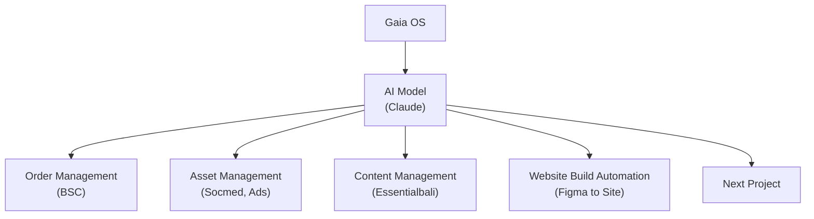

# Advanced Gaia OS — 180-Day Master Build and Operating Design

**Prepared for:** Gaia Digital Agency  
**Date:** 2026-04-23  
**Document purpose:** Unified rewrite of the prior 180-day implementation plan and the organization/system design into one master document for building **Advanced Gaia OS** through phased projects, usable modules, and controlled consolidation.

## 1. Executive Summary

Advanced Gaia OS should be built as a **practical accumulation of working modules** over 180 days rather than as one monolithic transformation program. The objective is to create a usable operating system for Gaia that improves delivery speed, consistency, reuse, and scale without proportional manpower growth.

This document reframes the build around four realities:

1. **Gaia needs working capability early, not only a future target state.**
2. **Each phase must produce usable outputs, not just planning artifacts.**
3. **Every project must contribute to one larger operating system.**
4. **Change management must happen in parallel across people, process, and system/equipment.**

The 180-day program is therefore structured as:

- **5 phases**
- **20 projects**
- **5 main module groups under Gaia OS**
- **one controlled operating model**
- **one consolidation path into the main Gaia OS**

The first 180 days focus on building Gaia OS in a way that is immediately useful to delivery teams while steadily increasing system maturity.

## 2. Target Hierarchy Diagram

### 2.1 Plain hierarchy

```text
Gaia OS
└── AI Model (Claude)
    ├── Order Management (BSC)
    ├── Asset Management (Socmed, Ads)
    ├── Content Management (Essentialbali)
    ├── Website Build Automation (Figma To Site)
    └── Next Project
```

### 2.2 Mermaid diagram



### 2.3 Interpretation of the hierarchy

This diagram should be understood as the **operating hierarchy for the first build horizon**, not the permanent final architecture of every future Gaia system.

- **Gaia OS** is the umbrella operating layer.
- **AI Model (Claude)** is the active intelligence core for the current scope and delivery logic.
- The five boxes below it represent the first practical module groups to be built, used, refined, and then consolidated.

The term **Next Project** is intentionally kept open. It reserves structured expansion capacity without forcing premature scope.

## 3. Core Design Principles

### 3.1 Build for use, not only for architecture purity

Each phase should produce working outputs that teams can use in live or near-live operations.

### 3.2 Consolidate, do not fragment

A module may begin as a standalone project capability, but it must be designed for eventual consolidation into Gaia OS.

### 3.3 Keep humans at the commercial and reputational edge

AI can draft, route, summarize, classify, recommend, and execute bounded tasks. Humans remain accountable for:

- final public outputs,
- final client-facing commitments,
- scope and pricing changes,
- budget changes,
- high-risk decisions,
- brand-sensitive approvals,
- deployment signoff.

### 3.4 Use modular governance

Every module must have:

- a named owner,
- a clear scope,
- an approval path,
- a KPI set,
- a dependency map,
- an integration path into Gaia OS.

### 3.5 Design around reusable patterns

The build should emphasize repeatable operating patterns such as:

- standardized intake,
- reusable context loading,
- structured execution and QA,
- controlled approval and release,
- monitoring and optimization.

### 3.6 Do not scale chaos

Modules should not be expanded broadly until:

- outputs are stable,
- the workflow is understandable,
- ownership is clear,
- rework is under control,
- metrics are visible.

## 4. Change Management Framework

Advanced Gaia OS is not just a system build. It is a change program across **people, process, and system/equipment**.

### 4.1 People

The people layer concerns role evolution, training, accountability, and adoption.

Key design direction:

- copywriters become editors and prompt/pattern owners,
- designers become visual directors and review owners,
- developers become AI-assisted engineers and finishers,
- SEO staff become strategy and QA owners,
- account staff become orchestration and client objective owners,
- AI operations becomes the system governance and operating control function.

People change must include:

- role clarity,
- training by module,
- revised approval responsibility,
- escalation discipline,
- adoption review,
- clear performance expectations.

### 4.2 Process

The process layer concerns how work moves.

Every Gaia OS module should follow the shared operating flow described later in this document, adapted to the needs and risk level of the specific module.

Process change must include:

- SOP design,
- queue states,
- handoff rules,
- exception handling,
- revision rules,
- signoff gates,
- reporting cadence.

### 4.3 System / equipment

The system/equipment layer includes the actual platform and tool environment.

This includes:

- Claude-led execution layer,
- OpenClaw or equivalent orchestration patterns where relevant,
- GCP-hosted infrastructure,
- PostgreSQL and workflow state storage,
- memory and retrieval layers,
- review and approval interfaces,
- deployment and observability stack,
- web and content tooling,
- QA tooling,
- operator UI.

System change must include:

- environment separation,
- access control,
- workflow logging,
- observability,
- tool enablement,
- maintenance ownership.

### 4.4 Change rule by phase

Each phase in the 180-day program must explicitly state:

- what changes for people,
- what changes for process,
- what changes for system/equipment,
- how those changes are stabilized before expansion.

## 5. Gaia OS Operating Model

### 5.1 Shared operating layers

Across all module groups, Gaia OS should use one shared operating flow: intake, context loading, planning, execution, QA, human review, release, monitoring, and optimization. Modules can simplify or combine steps where appropriate, but the control logic should stay consistent.

### 5.2 Shared enabling systems

The first 180-day build should assume the following enabling layer:

- GCP as primary infrastructure backbone,
- Claude as current primary working model for this operating hierarchy,
- optional multi-provider fallback retained architecturally,
- PostgreSQL for workflow and operational state,
- structured memory and retrieval,
- review and approval interfaces,
- environment separation for dev, staging, and production,
- logging, observability, and cost tracking,
- central prompt, template, and playbook repository.

### 5.3 Governance rules

The following rules should apply across the build:

- no direct public publishing without human approval,
- no direct budget changes without human approval,
- no client-facing deployment without checklist signoff,
- no module expansion without measurable proof,
- all reusable logic must be documented,
- all active workflows must have named owners,
- all exceptions must have escalation logic.

## 6. Gaia OS Module Groups

## 6.1 Module Group A — Order Management (BSC)

### Purpose
Create a structured system for receiving, routing, processing, tracking, and closing orders or requests tied to BSC operations.

### Intended business value
- faster order handling,
- lower coordination friction,
- clearer queue ownership,
- stronger visibility of status,
- easier reporting and issue escalation.

### Core capabilities
- order intake,
- order classification,
- status tracking,
- approval routing,
- exception handling,
- summary and reporting.

### People impact
- staff move from manual chasing to monitored workflow supervision,
- defined owners for intake, approval, exception handling, and closure,
- reduced dependence on chat memory and individual follow-up.

### Process impact
- standardized order states,
- approval gates,
- escalation paths,
- SLA tracking,
- structured close-out logic.

### System/equipment impact
- order forms or intake channels,
- workflow database,
- operator dashboard,
- routing and notification logic,
- audit logs.

### Early outputs
- order intake dashboard,
- order status tracker,
- exception queue,
- weekly status report.

## 6.2 Module Group B — Asset Management (Socmed, Ads)

### Purpose
Create a structured operating layer for managing media assets, creative variants, campaign assets, approvals, and publishing readiness across social media and ads.

### Intended business value
- better creative organization,
- faster reuse of approved assets,
- lower creative confusion,
- clearer linkage between campaigns and assets,
- stronger brand control.

### Core capabilities
- asset ingestion,
- tagging and categorization,
- brand alignment metadata,
- campaign linkage,
- approval status,
- publish-ready packaging,
- archive and reuse logic.

### People impact
- creative and account teams gain clearer control over source-of-truth assets,
- less time spent hunting files,
- better handoff between creative, copy, and campaign teams.

### Process impact
- intake standards,
- naming conventions,
- approval workflow,
- version control,
- asset-to-campaign mapping.

### System/equipment impact
- centralized asset repository,
- metadata schema,
- approval queue,
- UI layer for review and retrieval,
- usage tracking.

### Early outputs
- asset taxonomy,
- campaign asset register,
- approval board,
- reusable creative library.

## 6.3 Module Group C — Content Management (Essentialbali)

### Purpose
Build a content operating layer for Essentialbali and related content-driven properties covering planning, briefs, drafting, review, publishing, and refresh cycles.

### Intended business value
- higher content throughput,
- more consistent voice and structure,
- shorter content cycle time,
- stronger publishing discipline,
- reusable editorial memory.

### Core capabilities
- content brief generation,
- planning calendar,
- structured drafting,
- editorial QA,
- approval routing,
- CMS handoff,
- refresh recommendations.

### People impact
- writers shift toward editor-reviewer roles,
- editors gain structured workflows,
- account/content leads gain visibility of pipeline and quality.

### Process impact
- brief-first content production,
- content status states,
- editorial review gates,
- content refresh logic,
- publishing handoff control.

### System/equipment impact
- content database or queue,
- brief templates,
- prompt library,
- editorial dashboard,
- CMS integration patterns.

### Early outputs
- content brief engine,
- editorial queue,
- approval workflow,
- publishing packet format.

## 6.4 Module Group D — Website Build Automation (Figma to Site)

### Purpose
Build Gaia’s AI-assisted web delivery engine from Figma input to deployable site output with human finishing and QA controls.

### Intended business value
- faster time to scaffold,
- faster time to staging,
- more repeatable delivery,
- lower boilerplate effort,
- stronger QA consistency,
- higher reusable delivery IP.

### Core capabilities
- Figma intake,
- structure interpretation,
- component mapping,
- code scaffold generation,
- CMS/data model generation where needed,
- automated QA,
- deployment packaging,
- finisher handoff.

### People impact
- developers become AI-assisted build owners and finishers,
- QA becomes a formal gate rather than a late patch step,
- project leads gain predictable build stages.

### Process impact
- standard web intake,
- staged build pipeline,
- QA remediation loop,
- staging signoff,
- deployment signoff,
- post-launch maintenance path.

### System/equipment impact
- Figma access workflow,
- code generation environment,
- staging environment,
- automated QA tools,
- deployment scripts,
- template libraries.

### Early outputs
- intake template,
- starter scaffold packs,
- QA checklist engine,
- staging release packet.

## 6.5 Module Group E — Next Project

### Purpose
Reserve structured capacity for the next validated module without destabilizing the core build.

### Intended business value
- enables controlled expansion,
- prevents architecture dead-ends,
- allows Gaia to respond to new demand without rewriting the platform logic.

### Candidate examples
- client reporting intelligence,
- sales and proposal automation,
- internal knowledge assistant,
- booking or concierge logic,
- analytics consolidation,
- white-label partner workflow.

### Rule for activation
A Next Project may enter the build queue only if:

- a business owner is named,
- the use case is clear,
- the dependency map is known,
- change-management implications are understood,
- it does not break the current 180-day core priorities.

## 7. Delivery Architecture for Gaia OS

### 7.1 Recommended logic

The system should follow a controlled hierarchy:

- **Gaia OS** as umbrella operating layer,
- **AI core** as reasoning and execution engine,
- **module groups** as functional operating domains,
- **module workflows** as bounded execution patterns,
- **human operators** as reviewers, approvers, and escalation owners.

### 7.2 Recommended internal structure pattern

Within each module group, Gaia should use a practical structure similar to:

- **Orchestrator** — intake, routing, dependency control,
- **Agent** — module owner for a functional area,
- **Sub-workflow / specialist unit** — bounded execution step.

This keeps the architecture modular without forcing every function into overly complex multi-agent behavior at the start.

### 7.3 Memory model

Memory should be scoped at four levels:

1. organization/shared memory,
2. module memory,
3. workflow memory,
4. session/task memory.

No workflow should automatically receive unrestricted access to all context.

### 7.4 Approval model

Human approval is mandatory for:

- final public outputs,
- final campaign releases,
- budget shifts,
- client scope changes,
- pricing changes,
- external brand-sensitive assets,
- production deployment.

### 7.5 UI principle

Default human entry should be at the module owner or orchestration layer, not at the deepest execution step.

The UI should expose:

- module list,
- active queues,
- approval requests,
- memory references,
- status badges,
- execution logs,
- linked artifacts.

## 8. 180-Day Program Structure

The 180-day build should be run as **five phases** with an initial planning baseline of **20 projects**.

This roadmap should stay flexible. New projects may be introduced, deferred, combined, or replaced as real needs arise, provided they fit the phase objective, have a named owner, and do not destabilize core priorities.

### Phase logic

- **Phase 1** establishes operating control and core structures.
- **Phase 2** builds usable workflow modules.
- **Phase 3** puts modules into practical delivery use.
- **Phase 4** consolidates, integrates, and strengthens reliability.
- **Phase 5** packages Gaia OS for broader controlled use and next-stage scale.

## 9. Flexible Project Roadmap

The project list below is the current recommended sequence, not a locked scope contract. Gaia should treat it as a controlled backlog that can evolve while preserving the phase logic and consolidation path.

## Phase 1 — Foundation and Control (Days 1–36)

### Project 1 — Gaia OS Governance Charter
**Objective:** Establish ownership, governance, decision rights, and operating rules.  
**Immediate usable output:** governance charter, named owners, decision matrix.  
**Consolidation contribution:** creates the control layer of Gaia OS.

**People:** define accountable owners and approval authorities.  
**Process:** define cadence, escalation, and signoff logic.  
**System/equipment:** define environments, access roles, and audit requirements.

### Project 2 — Shared Intake and Workflow Standards
**Objective:** Standardize how work enters Gaia OS.  
**Immediate usable output:** intake templates, classification rules, workflow states.  
**Consolidation contribution:** creates one common input logic across modules.

**People:** intake ownership and triage roles.  
**Process:** common states and routing rules.  
**System/equipment:** intake forms, queue schema, status model.

### Project 3 — Memory and Context Schema
**Objective:** Define structured memory design across clients, brands, projects, and workflows.  
**Immediate usable output:** memory fields, context packs, retrieval rules.  
**Consolidation contribution:** creates reusable context architecture for Gaia OS.

**People:** owners of memory quality and updates.  
**Process:** context load and refresh rules.  
**System/equipment:** database tables, retrieval layer, permissions.

### Project 4 — Operator UI and Approval Board v1
**Objective:** Create the first operator-facing control interface.  
**Immediate usable output:** simple dashboard showing queue, approval, and status visibility.  
**Consolidation contribution:** becomes the operating surface for Gaia OS.

**People:** operator role and reviewer role defined.  
**Process:** approval workflow and log review.  
**System/equipment:** UI shell, authentication, approval queue.

## Phase 2 — Module Build (Days 37–72)

### Project 5 — Order Management (BSC) Intake Module
**Objective:** Build the intake and routing base for BSC order workflows.  
**Immediate usable output:** intake register and order classification view.  
**Consolidation contribution:** first live functional module under Gaia OS.

**People:** order owner and exception owner.  
**Process:** intake, assign, update, close.  
**System/equipment:** order table, intake channel, basic dashboard.

### Project 6 — Asset Management Taxonomy and Approval Module
**Objective:** Build asset organization, metadata, and approval control for Socmed and Ads.  
**Immediate usable output:** working asset library with status and tagging.  
**Consolidation contribution:** creates reusable campaign asset memory.

**People:** creative owner, reviewer, account owner.  
**Process:** ingest, review, approve, archive.  
**System/equipment:** repository structure, taxonomy, approval board.

### Project 7 — Content Management Brief and Queue Module
**Objective:** Build the content brief engine and editorial work queue for Essentialbali content operations.  
**Immediate usable output:** brief template system and content queue.  
**Consolidation contribution:** creates reusable editorial operating logic.

**People:** content owner, editor, approver.  
**Process:** brief, draft, review, approve, publish handoff.  
**System/equipment:** content queue, brief generator, editorial UI.

### Project 8 — Website Build Automation Intake and Scaffold Module
**Objective:** Build the first usable Figma-to-site intake and scaffold flow.  
**Immediate usable output:** web project intake format and starter scaffold pipeline.  
**Consolidation contribution:** starts Gaia’s web automation engine.

**People:** web delivery owner, finisher, QA owner.  
**Process:** intake, scaffold, review, refine.  
**System/equipment:** intake template, repo structure, starter scaffold system.

## Phase 3 — Live Use and Workflow Completion (Days 73–108)

### Project 9 — Order Management Workflow Completion
**Objective:** Add status progression, approval steps, and reporting to BSC order flows.  
**Immediate usable output:** live end-to-end order workflow.  
**Consolidation contribution:** turns order intake into operational order control.

**People:** operational owner and approval owner.  
**Process:** lifecycle management and SLA tracking.  
**System/equipment:** workflow transitions, notifications, reporting output.

### Project 10 — Asset-to-Campaign Linkage Module
**Objective:** Connect asset management to campaign and channel execution.  
**Immediate usable output:** campaign-linked asset pack view.  
**Consolidation contribution:** bridges creative storage and execution.

**People:** campaign manager and creative lead alignment.  
**Process:** request, produce, review, assign to campaign.  
**System/equipment:** linkage fields, campaign mapping, retrieval UI.

### Project 11 — Content Drafting and Editorial QA Module
**Objective:** Extend content operations from planning into draft and editorial control.  
**Immediate usable output:** editorial draft workflow with QA checkpoints.  
**Consolidation contribution:** moves content management into practical operating use.

**People:** editor and quality reviewer become formal gates.  
**Process:** draft, QA, revise, approve.  
**System/equipment:** QA checklist, review states, revision tracking.

### Project 12 — Website QA and Staging Module
**Objective:** Add QA, issue summarization, and staging readiness into the web automation workflow.  
**Immediate usable output:** first web QA and staging packet.  
**Consolidation contribution:** creates a controlled release path for the web module.

**People:** QA lead and deployment approver become explicit.  
**Process:** test, remediate, sign off for staging.  
**System/equipment:** automated QA scripts, issue board, staging checklist.

## Phase 4 — Integration and Consolidation (Days 109–144)

### Project 13 — Shared Reporting and KPI Layer
**Objective:** Create one reporting logic across modules.  
**Immediate usable output:** module dashboards and weekly operating scorecard.  
**Consolidation contribution:** creates management visibility across Gaia OS.

**People:** module owners report through one KPI structure.  
**Process:** weekly review and issue escalation.  
**System/equipment:** reporting tables, dashboard views, KPI definitions.

### Project 14 — Shared Approval and Escalation Engine
**Objective:** Standardize approval states and escalation rules across all active modules.  
**Immediate usable output:** one approval rulebook and approval interface.  
**Consolidation contribution:** central control layer for Gaia OS.

**People:** reviewers and approvers become consistent by risk level.  
**Process:** escalate by type, not by improvisation.  
**System/equipment:** approval engine, notification logic, audit log.

### Project 15 — Shared Memory Refinement and Reuse Layer
**Objective:** Improve structured memory so learnings from modules become reusable assets.  
**Immediate usable output:** reusable templates, prompt patterns, and module memory packs.  
**Consolidation contribution:** turns project outputs into permanent Gaia OS capability.

**People:** pattern owners and memory maintainers defined.  
**Process:** capture, review, publish reusable logic.  
**System/equipment:** memory repository, template versioning, access rules.

### Project 16 — Website Deployment and Maintenance Module
**Objective:** Extend web automation beyond staging into deployable and maintainable delivery.  
**Immediate usable output:** deploy checklist, launch packet, maintenance workflow.  
**Consolidation contribution:** makes Website Build Automation operationally complete.

**People:** launch approver and maintenance owner assigned.  
**Process:** deploy, monitor, support, update.  
**System/equipment:** deployment scripts, release process, maintenance logs.

## Phase 5 — Gaia OS Consolidation and Scale Readiness (Days 145–180)

### Project 17 — Gaia OS Module Control Center
**Objective:** Merge active modules into one visible control surface.  
**Immediate usable output:** unified dashboard for module status, approvals, KPIs, and logs.  
**Consolidation contribution:** visible operational Gaia OS layer.

**People:** leadership and operators share one management view.  
**Process:** integrated review cadence.  
**System/equipment:** consolidated UI, status layer, log aggregation.

### Project 18 — Service Packaging and Standard Operating Packs
**Objective:** Convert working module capabilities into repeatable internal or client service packs.  
**Immediate usable output:** module-based service definition packs.  
**Consolidation contribution:** commercializes usable parts of Gaia OS.

**People:** account and delivery teams align around standard packs.  
**Process:** onboarding, scope boundaries, handoff standards.  
**System/equipment:** templates, proposal logic, service configuration.

### Project 19 — Training, Role Reset, and Adoption Wave 2
**Objective:** Lock in role redesign and operating adoption after live module use.  
**Immediate usable output:** revised role matrix, adoption plan, training wave 2 materials.  
**Consolidation contribution:** stabilizes change management across the organization.

**People:** role transition becomes formal.  
**Process:** training and adoption loops become ongoing.  
**System/equipment:** learning materials, SOP repository, role-linked interfaces.

### Project 20 — Next Project Activation Pack
**Objective:** Prepare the framework for the next validated Gaia OS module after Day 180.  
**Immediate usable output:** prioritization matrix, readiness checklist, candidate backlog.  
**Consolidation contribution:** creates disciplined expansion instead of uncontrolled scope growth.

**People:** sponsor and module owner requirements defined.  
**Process:** module entry criteria formalized.  
**System/equipment:** backlog tracker, scoring model, dependency map.

## 10. Phase-by-Phase Change Management Summary

## Phase 1

### People
- clarify leadership and review roles,
- assign module owners,
- define approval authorities.

### Process
- standardize intake,
- define workflow states,
- define governance cadence.

### System/equipment
- create queue schema,
- create memory schema,
- create first UI layer.

## Phase 2

### People
- activate functional owners by module,
- begin role shift from manual production to structured supervision.

### Process
- stand up module-specific workflows,
- start using standard templates and metadata.

### System/equipment
- build first live module tools,
- activate repository structures and intake systems.

## Phase 3

### People
- introduce formal QA and review gates,
- strengthen operator discipline.

### Process
- complete end-to-end workflows,
- reduce ad hoc coordination.

### System/equipment
- extend modules with QA, reporting, and release steps.

## Phase 4

### People
- move from module experimentation to controlled ownership,
- define cross-module review responsibilities.

### Process
- standardize shared approvals, escalation, and reporting.

### System/equipment
- integrate memory, reporting, and deployment logic.

## Phase 5

### People
- formalize role redesign,
- shift teams toward orchestration and system-led delivery.

### Process
- package standard operating routines,
- define the entry path for future modules.

### System/equipment
- consolidate interfaces,
- enable broader controlled use of Gaia OS.

## 11. Roles and Governance

### 11.1 Required named owners

The first 180 days should have at minimum:

- Gaia OS sponsor,
- AI division lead,
- technical/platform owner,
- web automation owner,
- asset management owner,
- content management owner,
- order management owner,
- QA/governance owner,
- commercial/account interface owner.

### 11.2 Decision rights

The following decision rights should be explicit:

- module scope approval,
- deployment approval,
- publishing approval,
- budget exception approval,
- client risk escalation,
- new module activation approval.

### 11.3 Weekly cadence

Recommended cadence:

- **Monday:** module status and blocker review,
- **Wednesday:** workflow and build review,
- **Friday:** performance, approvals, and next actions review.

### 11.4 Monthly cadence

Recommended cadence:

- module scorecard review,
- adoption and training review,
- KPI and cost review,
- risk review,
- Next Project prioritization review.

## 12. KPI Framework

### 12.1 Gaia OS level KPIs

- active modules in productive use,
- percentage of workflows under structured control,
- approval turnaround time,
- reuse rate of templates and patterns,
- reduction in manual coordination time,
- visibility of module KPIs,
- system uptime and workflow reliability.

### 12.2 Order Management KPIs

- intake-to-assignment time,
- order closure time,
- exception rate,
- SLA compliance,
- status visibility completeness.

### 12.3 Asset Management KPIs

- asset retrieval time,
- approval turnaround,
- asset reuse rate,
- campaign linkage completeness,
- version confusion reduction.

### 12.4 Content Management KPIs

- brief-to-draft cycle time,
- draft-to-approval time,
- revision rounds,
- content throughput,
- publishing readiness rate.

### 12.5 Website Build Automation KPIs

- time to scaffold,
- time to staging,
- QA pass rate,
- manual finishing hours,
- launch cycle time,
- post-launch defect rate.

## 13. Suggested High-Level System Structure

```text
/opt/gaia-os/
├── control-ui/
│   ├── frontend/
│   ├── backend/
│   └── shared/
├── modules/
│   ├── order-management-bsc/
│   ├── asset-management-socmed-ads/
│   ├── content-management-essentialbali/
│   ├── website-build-automation/
│   └── next-project/
├── shared/
│   ├── memory/
│   ├── templates/
│   ├── policies/
│   ├── prompts/
│   ├── reporting/
│   └── qa/
├── sessions/
├── logs/
├── runtime/
└── deployments/
```

This structure is meant to keep module ownership clear while still allowing shared services and consolidation.

## 14. Day-180 Target State

By Day 180, Gaia should be able to say the following with confidence:

1. Gaia OS exists as a visible, controlled operating layer.
2. Order Management, Asset Management, Content Management, and Website Build Automation are each usable in practical operations.
3. Teams are operating with clearer role boundaries and more structured workflows.
4. Human approval remains in place at critical commercial and reputational edges.
5. Shared memory, approvals, KPIs, and UI control are beginning to function as one system rather than disconnected tools.
6. The next expansion module can be selected using governance rather than improvisation.

## 15. Final Recommendation

Gaia should treat the next 180 days as the period in which it proves not only that AI can assist the business, but that Gaia can build a durable operating model around it.

The correct implementation logic is:

- build through **phased projects**,
- organize work as **module groups**,
- ensure every project produces **usable capability**,
- manage change across **people, process, and system/equipment**,
- consolidate each completed capability upward into **Advanced Gaia OS**.

The final measure of success is not whether many experiments were attempted. The final measure is whether Gaia has built a disciplined operating system that is practical, visible, governable, and ready for the next wave of scale.
